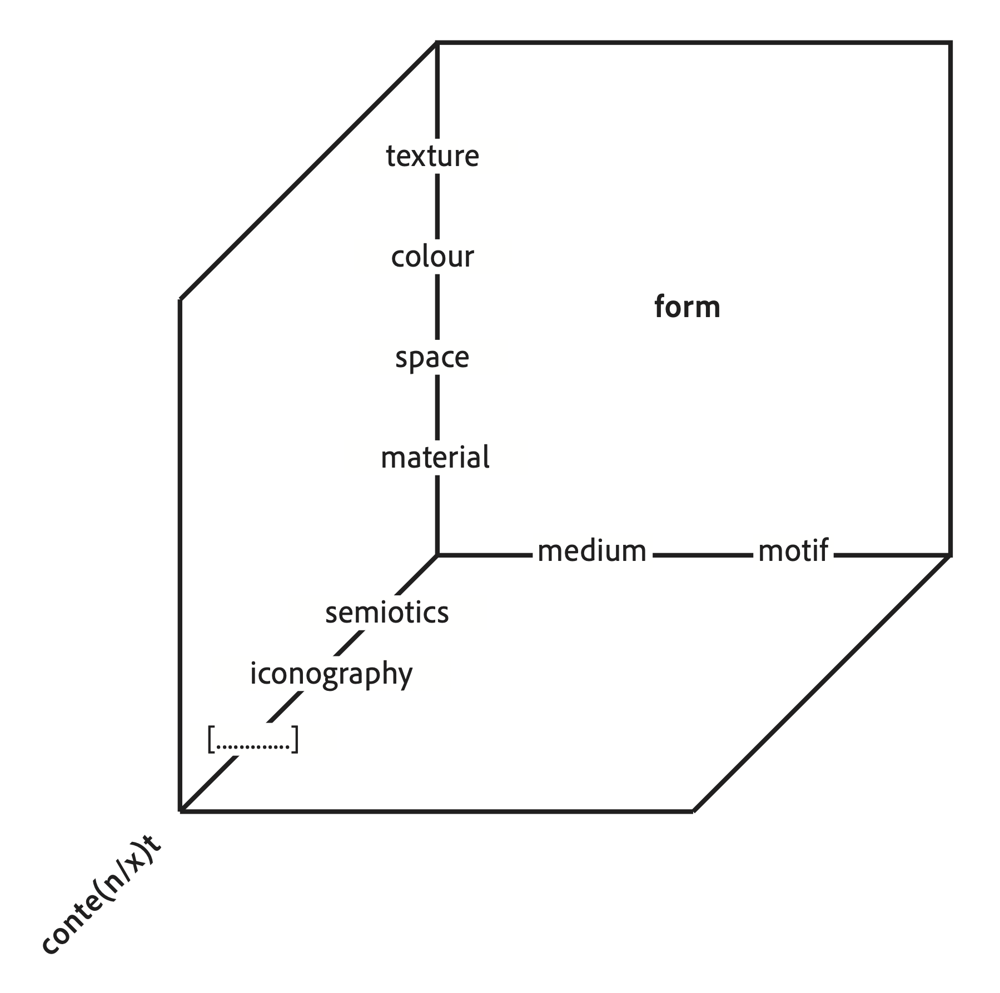
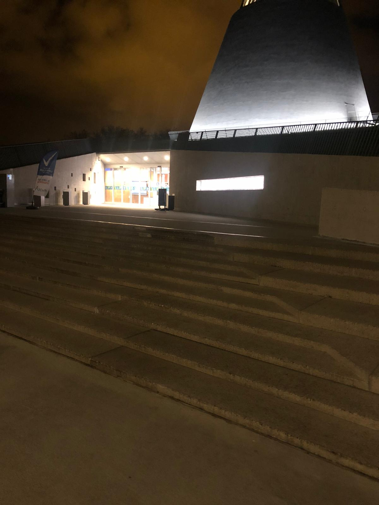
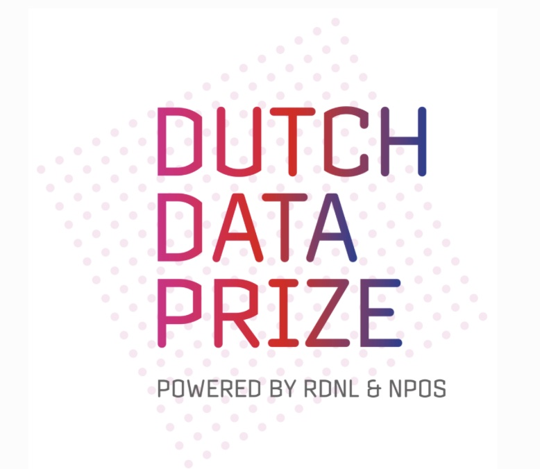
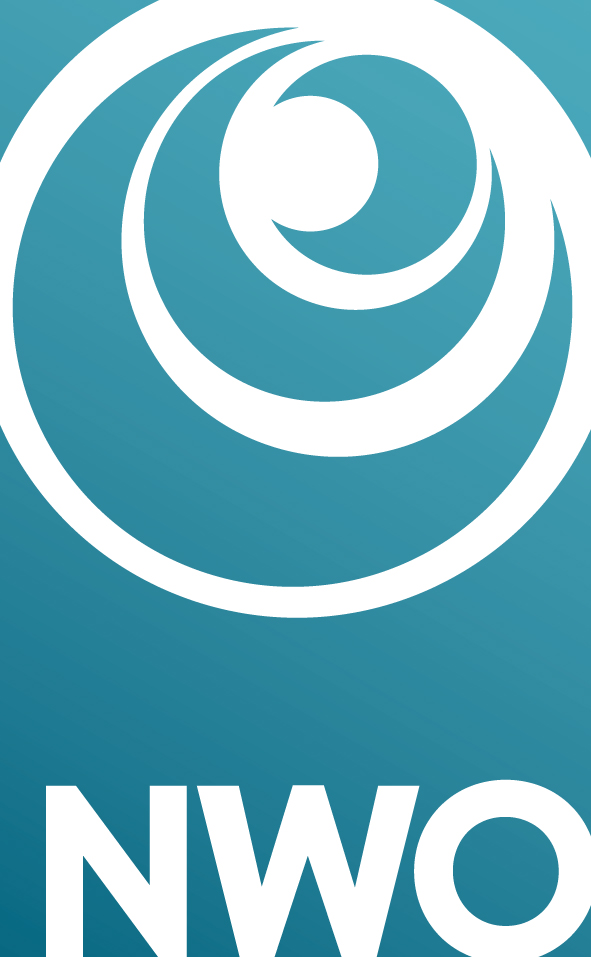

# Updates
- **30 November 2023**: [Keynote collective](#the-keynote-collective) experienced a substantial expansion (Evelina Domnitch + Dmitry Gelfand joined!).
- **30 November 2023**: The early bird [registration](#registration) date is pushed forward to 15 December.
-
- **1 November 2023**: [Keynote collective](#the-keynote-collective) announced.
- **1 November 2023**: [Special activities](#special-activities) announced.
- **15 October 2023**: [Registration](#registration) is open.
- **15 October 2023**: [Abstract submission](#abstract-submission-and-presentation-types) is open.

# Intro
After two conferences The Skin of Things [2018](https://theskinofthings.github.io) and [2021](https://theskinofthings2021.github.io) that focussed on the depiction and perception of *material properties*, we decided to broaden the scope and organise **Vision and Depiction 2024**. It will take place in the lovely Dutch city of *Delft* from *7-9 February 2024*.

# About
This conference about pictorial production and perception aims to bring artists, designers, and scientists together to discuss various overlapping themes. These themes are based on our Vision and Depiction framework that has been developed while teaching about perception and communication. The framework describes the form and content of pictures. For now, we envision talk sessions centring around the elements of the framework. Within these themes, we hope to evoke discussions on both the medium and representation but also in the directions of semiotics and iconography and further contextual contemplation.

# Participants
We hope to attract a wide variety of scientists and artists. Here is an indication of potential disciplines that we envision.
- **Artists/designers:** Every artist/designer who is involved in visual culture either be reflecting upon, or experimenting with various forms and techniques of visual communication.
- **Vision science:** Researchers involved in visual perception related to the arts or more specifically to any of the Vision and Depiction framework elements.
- **Art history:** Scholars from (technical) art history investigating various aspects of motifs and/or medium. Also subjects such as style, and the mystery of mastery are relevant.
- **Computer science:** Computer vision and graphics has a long tradition of image synthesis that has clear parallels with the longer art history of depiction.
- **Digital humanities:** With the emergences of large open access image databases, a new field has emerged around the computational analysis of image collections and more recently also using AI both as analytical tools but also as subject matter.
- **Archeology and Anthropology:** The usage of images, pictorial traditions and conventions throughout various (historical) cultures.

## The keynote collective
We are very excited to host a group of artists and scientists that represent both the core and the breadth of Vision and Depiction. While we may add one or two extra, we can now confirm the participation of the *artists*:

- [Persijn Broersen and Margit Lukacs](https://www.pmpmpm.com/)
- [Joost Swarte](https://www.joostswarte.nl)
- [Janne Schimmel](https://janneschimmel.com)
- [Evelina Domnitch + Dmitry Gelfand](http://www.portablepalace.com)

... and *scientists*:

- [Ann-Sophie Lehmann](https://www.rug.nl/staff/a.s.lehmann/?lang=en) - Art History
- [Hannah Smithson](https://www.psy.ox.ac.uk/people/hannah-smithson) - Vision Science
- [Paul Pettitt](https://www.durham.ac.uk/staff/paul-pettitt/) - Archeology

... and our *special guest*:
- [Tim Jenison](https://en.wikipedia.org/wiki/Tim%27s_Vermeer)

# Preliminary program
We will have more concrete information soon, but for now we fixed the start and end times:
- *Start* on Wednesday 7 February at 13:00
- *End* on Friday 9 Februari at 18:30 (although we will likely have a farewell reception/activity!) 

# Themes
We have a top-down idea about our ideal set op topics, although this will critically depend on the submissions we attract. In reality the program will likely be also driven by a bottom up approach where we cluster the available contributions into meaningful units. But before reality hits, these topics would ideally serve as pillars:

- **Texture:** Although the word 'texture' may have different meanings in different disciplines, *the structure of patterns* seems a universally fascinating. The 3D texture of paint, generative algorithms replicating natural phenomena, ornamental patterns, traces of various media (such as half tone dots or etch lines), interactions between textures in the medium and textures in the representation, texture bias in deep neural networks, these are just a few examples that bring together vision and depiction.

- **Color and Light:** Both color and light have their own traces throughout visual culture, e.g. the treatment and meaning of shadows, the invention of pigments (from Vanta black to DayGlow fluorescent), the colour of shadows, the depiction of time of day, and so on.

- **Space:** While Apple just announced the 'revolutionary' Vision Pro,  there is a long history of revolutions related to pictorial space. Choices and conventions relating to the 3D composition of scenes and the perception of space and spatial relations can be studied from both vision and depiction perspectives.

- **Material:** As opposed to space, there is much less known about the depiction of material, although in recent years many new studies have been published. It still is one of the most fascinating themes both in art history and in contemporary image creation and artistic practice.

- **Context and meaning:** All the formal elements lead up to meaning and reference which also implies the importance of context. Not only does the pattern of colours evoke human recognition and identification of the depicted motif, i.e. the study of visual object recognition, the motif also refers to something outside the framed canvas, e.g. to other cultural modalities (e.g. literature).

- **Medium vs Motif / real vs reproduction**: There is always an interplay between the physical manifestation of an artwork and what it represents. This interplay becomes even more interesting when considering reproductions, either digital or physical.

# Special activities

## Workshop by Delft Design Drawing
The design education in Delft has a long tradition of [design drawing](https://www.instagram.com/delftdesigndrawing/). During the workshop, they will ensure that you will not only contemplate but also practice Vision and Depiction.

<blockquote class="instagram-media" data-instgrm-permalink="https://www.instagram.com/p/CoIcOeaoant/?utm_source=ig_embed&amp;utm_campaign=loading" data-instgrm-version="14" style=" background:#FFF; border:0; border-radius:3px; box-shadow:0 0 1px 0 rgba(0,0,0,0.5),0 1px 10px 0 rgba(0,0,0,0.15); margin: 1px; max-width:540px; min-width:326px; padding:0; width:99.375%; width:-webkit-calc(100% - 2px); width:calc(100% - 2px);">
 <a href="https://www.instagram.com/p/CoIcOeaoant/?utm_source=ig_embed&amp;utm_campaign=loading" style=" background:#FFFFFF; line-height:0; padding:0 0; text-align:center; text-decoration:none; width:100%;" target="_blank"> 
 

 
 

 

 
<svg width="50px" height="50px" viewBox="0 0 60 60" version="1.1" xmlns="https://www.w3.org/2000/svg" xmlns:xlink="https://www.w3.org/1999/xlink"><g stroke="none" stroke-width="1" fill="none" fill-rule="evenodd"><g transform="translate(-511.000000, -20.000000)" fill="#000000"><g><path d="M556.869,30.41 C554.814,30.41 553.148,32.076 553.148,34.131 C553.148,36.186 554.814,37.852 556.869,37.852 C558.924,37.852 560.59,36.186 560.59,34.131 C560.59,32.076 558.924,30.41 556.869,30.41 M541,60.657 C535.114,60.657 530.342,55.887 530.342,50 C530.342,44.114 535.114,39.342 541,39.342 C546.887,39.342 551.658,44.114 551.658,50 C551.658,55.887 546.887,60.657 541,60.657 M541,33.886 C532.1,33.886 524.886,41.1 524.886,50 C524.886,58.899 532.1,66.113 541,66.113 C549.9,66.113 557.115,58.899 557.115,50 C557.115,41.1 549.9,33.886 541,33.886 M565.378,62.101 C565.244,65.022 564.756,66.606 564.346,67.663 C563.803,69.06 563.154,70.057 562.106,71.106 C561.058,72.155 560.06,72.803 558.662,73.347 C557.607,73.757 556.021,74.244 553.102,74.378 C549.944,74.521 548.997,74.552 541,74.552 C533.003,74.552 532.056,74.521 528.898,74.378 C525.979,74.244 524.393,73.757 523.338,73.347 C521.94,72.803 520.942,72.155 519.894,71.106 C518.846,70.057 518.197,69.06 517.654,67.663 C517.244,66.606 516.755,65.022 516.623,62.101 C516.479,58.943 516.448,57.996 516.448,50 C516.448,42.003 516.479,41.056 516.623,37.899 C516.755,34.978 517.244,33.391 517.654,32.338 C518.197,30.938 518.846,29.942 519.894,28.894 C520.942,27.846 521.94,27.196 523.338,26.654 C524.393,26.244 525.979,25.756 528.898,25.623 C532.057,25.479 533.004,25.448 541,25.448 C548.997,25.448 549.943,25.479 553.102,25.623 C556.021,25.756 557.607,26.244 558.662,26.654 C560.06,27.196 561.058,27.846 562.106,28.894 C563.154,29.942 563.803,30.938 564.346,32.338 C564.756,33.391 565.244,34.978 565.378,37.899 C565.522,41.056 565.552,42.003 565.552,50 C565.552,57.996 565.522,58.943 565.378,62.101 M570.82,37.631 C570.674,34.438 570.167,32.258 569.425,30.349 C568.659,28.377 567.633,26.702 565.965,25.035 C564.297,23.368 562.623,22.342 560.652,21.575 C558.743,20.834 556.562,20.326 553.369,20.18 C550.169,20.033 549.148,20 541,20 C532.853,20 531.831,20.033 528.631,20.18 C525.438,20.326 523.257,20.834 521.349,21.575 C519.376,22.342 517.703,23.368 516.035,25.035 C514.368,26.702 513.342,28.377 512.574,30.349 C511.834,32.258 511.326,34.438 511.181,37.631 C511.035,40.831 511,41.851 511,50 C511,58.147 511.035,59.17 511.181,62.369 C511.326,65.562 511.834,67.743 512.574,69.651 C513.342,71.625 514.368,73.296 516.035,74.965 C517.703,76.634 519.376,77.658 521.349,78.425 C523.257,79.167 525.438,79.673 528.631,79.82 C531.831,79.965 532.853,80.001 541,80.001 C549.148,80.001 550.169,79.965 553.369,79.82 C556.562,79.673 558.743,79.167 560.652,78.425 C562.623,77.658 564.297,76.634 565.965,74.965 C567.633,73.296 568.659,71.625 569.425,69.651 C570.167,67.743 570.674,65.562 570.82,62.369 C570.966,59.17 571,58.147 571,50 C571,41.851 570.966,40.831 570.82,37.631"></path></g></g></g></svg>

 
View this post on Instagram

 

 

 

 

 

 

 

 

 

 
 

 

</a>
<a href="https://www.instagram.com/p/CoIcOeaoant/?utm_source=ig_embed&amp;utm_campaign=loading" style=" color:#c9c8cd; font-family:Arial,sans-serif; font-size:14px; font-style:normal; font-weight:normal; line-height:17px; text-decoration:none;" target="_blank">A post shared by Delft Design Drawing (IDE TUD) (@delftdesigndrawing)</a>

</blockquote> 

## When Images Remain
Before heading out for dinner, we will have a short evening walk to the TU Delft library to visit the on-campus art installation ['When Images Remain'](https://www.tudelft.nl/en/events/2023/library/exhibition-when-images-remain). In the photo below a light emitting strip can be seen, which is actually a window towards the TU Delft heritage collection. Here, When Images Remain shows a collection of magic lantern slides used in art eduction around 1930, complemented with images used in contemporary art education, interpolated by a generative prompting: the Vision and Depiction framework in action.

<!---->

# Location and venue
The conference will take place in the city of Vermeer, Delft, which is both a unique historical city in the Netherlands and hosts the Delft University of Technology. The city easy to reach by bike, car and train, and is a 38 minutes train ride away from Schiphol (Amsterdam) Airport. Everything is so close-by that in most cases you do not even need a bicycle. When walking from the train station to the campus you actually pass by the place Vermeer painted [View on Delft](https://www.mauritshuis.nl/en/our-collection/artworks/92-view-of-delft/), although it looks a bit [different](https://goo.gl/maps/xAuMbmfN3uijMygg7) nowadays.
The main conference will be on campus, but we may have some activities elsewhere.

# Timeline
- Abstract submission opens: 15 October 2023
- Abstract submission closes: 15 November 2023
- Notification of Acceptance: 30 November 2023
- Early bird registration: 1 December 2023
- Conference: 7-9 February 2024

# Registration

Registration is now open and can be done [here](https://www.aanmelder.nl/vision-and-depiction-2024/subscribe). If you also submit an abstract, you should use mention the title of you contribution in the registration form.

We have some funding but to cover the total cost of the conference we need to ask for a registration fee:

| Type | Early bird (< 1 december) | Late |
| :---         |     :---:      |          ---: |
| Full rate   | €120     | €170    |
| Reduced     | €70       | €100      |
| Waiver     | free      | free    |

Waivers are available for (a limited amount of) artists. Please reach out if you have questions about the waiver program.  

## Cancellation policy

- Cancellation before 7 December: 100% refund excl. €10 admin.
- Cancellation before 7 Januari: 50% refund excl. €10 admin.
- Cancellation after 7 Januari: no refund because by that time we have already paid contracts.

# Online

The talks will be recorded and shared (if speakers permit), but participation and interaction is aimed to be in-person.

# Abstract submission and presentation types
Please [submit](https://www.aanmelder.nl/vision-and-depiction-2024/author) a 300 word abstract of your contribution between 15 October and 15 November 2023. You can only submit one abstract as first author, but as many as you want as co-author. During the submission process you can share your preference for a poster or oral presentation. It could happen that the preferred oral presentations exceed the time we have for the conference. In that case we will assign posters on the basis of the reviewer assessments. We hope that poster presentations will not be seen as something less than oral presentations, posters are great media to facilitate direct and unrestricted discussions.

## Instructions
- After submitting your email adres in the link [above](#abstract-submission-and-presentation-types) you will be emailed further instructions.
- Do not forget to register for the conference [here](https://www.aanmelder.nl/vision-and-depiction-2024/subscribe) as we will only review abstracts of registered participants.
- Only exception of the above is when you are an artist, in that case you do not need to register prior to submitting your abstract, but will receive a waiver after a selection procedure. In case you do not receive a waiver, you will be allowed to register for the early bird fee.
- You can only submit one abstract as main author.
- You can give a preference of poster or oral presentation.

# Contact

# Organizing committee
Maarten Wijntjes 
Catelijne van Middelkoop 
Nim Goede 

# Funding

- Dutch Research Council (NWO), project number 276-54-001
- TU Delft - Library
- Faculty of Industrial Design Engineering, Delft University of Technology
- The Dutch Data Prize

 | |
:-------------------------:|:-------------------------:|:-------------------------:
 |  | 
