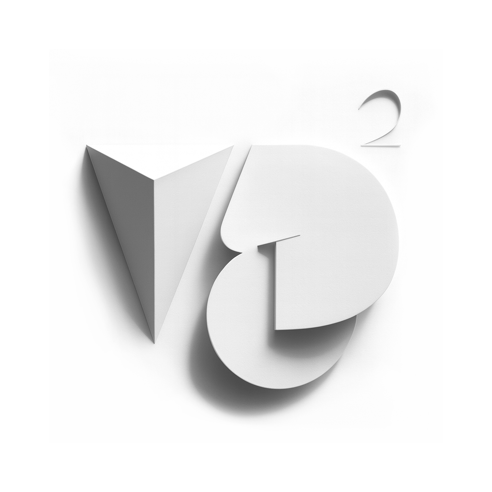
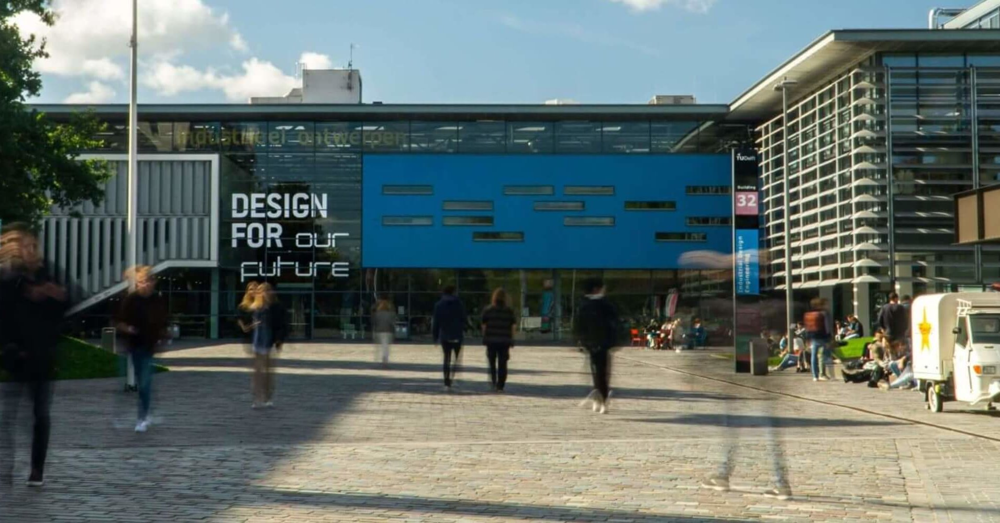

# Intro
Vision and Depiction 2026 took place from 4 to 6 February 2026. There are two ways to relive the experience:

- The [program](program.html) contains the abstract book but also a great number of video recordings.
- The [photos](https://visionanddepiction.s3.eu-central-1.amazonaws.com/photo_album.html) made by [Yuguang Zhao](https://yuguang-zhao.com) greatly captured the atmosphere.

Moreover, there is one thing left to do, which is creating the special issue we promised. [Below](#special-issue) you can find the complete call and instructions. The submission window is 1 May 2026 - 1 September 2026. 

# Live stream

_Live stream has finished_

<!--[Livestream](https://collegerama.tudelft.nl/Mediasite/Channel/ide-vision-and-depiction-ii) (Tip: click on the current date!)
It is free to watch, but if you feel generous, you can sponsor us by buying a special ticket of €50 on the [registration site](https://www.aanmelder.nl/vision-and-depiction-2/registration) (it is one of the ticket options).-->

# About

Vision and Depiction celebrates _form_ as interface between art and science. It is a conference about how to depict form, and how form is perceived. But it is also a conference about the many connections that form has with the content and context of pictures. Moreover, it is a conference about the interaction between the physical medium, and the mental presentations it gives rise to, i.e. about the relation between medium and motif.

# Call for abstracts
We invite artists, designers, scholars and scientists that are interested in the formal aspects of vision and depiction. This scope finds its' origin in a reappraisal of the formal analysis, particularly those formal elements that share commonalities between science and art. Examples are texture, color, light, shape, space, material, motion, etc. In addition, we are interested in whether these formal elements apply to the representation (motif) or on the artworks' surface (medium) and possibly the interaction between these two. Lastly, we are interested in the relations between formal elements and what they refer to, i.e. their iconographic or semiotic meaning. The scope is summarised in the Vision and Depiction framework  below and in a [background paper](https://doi.org/10.1080/13506285.2024.2320762).

If you doubt whether your work fits the scope, please contact us. In reality there is always a difference between the top-down imposed scope of a conference and how it turns out in reality. If you are curious how last edition turned out, visit the [Vision and Depiction 2024 online program](program2024.html).

We hope to attract a wide variety of scientists and artists. Here is an indication of potential disciplines that we envision.
- **Artists/designers:** Every artist/designer who is involved in visual culture either be reflecting upon, or experimenting with various forms and techniques of visual communication.
- **Vision science:** Researchers involved in visual perception related to the arts or more specifically to any of the Vision and Depiction framework elements.
- **Art history:** Scholars from (technical) art history investigating various aspects of motifs and/or medium. Also subjects such as style, and the mystery of mastery are relevant.
- **Computer science:** Computer vision and graphics has a long tradition of image synthesis that has clear parallels with the longer art history of depiction.
- **Digital humanities:** With the emergences of large open access image databases, a new field has emerged around the computational analysis of image collections and more recently also using AI both as analytical tools but also as subject matter.
- **Archeology and Anthropology:** The usage of images, pictorial traditions and conventions throughout various (historical) cultures.

# The keynote speakers
To delineate the scope the conference, we have invited keynote speakers spanning the breadth of topics and disciplines that define Vision and Depiction. We are very excited that we have two artist talks confirmed (we may add two more, unconfirmed). Moreover, we have five scientific talks confirmed, of which two 'senior' and three 'junior' talks. Yes, you read it correctly: we decided to offer the stage to three early stage researchers to present their work.

**Artists**
- [Jean-Baptiste Maitre](https://jbmaitre.com) & [Dina Danish](https://dinadanish.com)
- [Antye Guenther](https://aguenth.de)
- Roger Gerards (head of print design, [Vlisco](https://vlisco.com))

**Scientists** (senior)
- Joris van Gastel - Art History
- Pascal Barla - Computer Graphics

**Scientists** (junior)
- Eleftheria Pistolas - Vision Science
- Sam Hirst - Archaeology

# Abstracts submission

You can submit a 300 word abstract via our [registration website](https://www.aanmelder.nl/vision-and-depiction-2/).

During the online submission, you will be asked to select your presentation preference: poster or oral. Most people prefer to give an oral presentation for both practical reasons (you do not have  to print a poster, and you automatically reach a large audience) and prestige reasons (in some fields, an oral presentation is regarded more highly than a poster presentation). This is somewhat unfortunate because poster presentations can be very engaging as you have direct discussion with your peers, instead of the 3 minute time slot normally allotted at oral presentations. And to accommodate the practical burden, just like last edition, we will  provide a poster printing service! Give the finite time of the conference, we cannot guarantee all 'oral presentation' preferences and hope you will not be disappointed (and in fact, enjoy) a possible poster presentation!

There are some rules for the abstracts to be taken into consideration:
- You need to be registered as an attendee (check out the [cancellation policy](#cancellation-policy) which takes into account the notification of acceptance date).
- You can only submit **one** abstract as first author

# Information for presenters

## Poster presentation {#posters}
Posters should be prepaired in A0 (118.8 cm by 84 cm). The _default_ orientation is portrait (i.e. 118.8 cm high and 84 cm wide) but this year we offer the artistic freedom to re-orient your posterbaord by 90 degrees if you feel like a landscape poster does more justice to your presentation. 

We have a good poster printing service at Delft train station, I will put more info about this shortly. 

<!--If you want, you can print your poster in Delft at CSinBKCity, here are the [prices](https://csinbkcity.nl/price-list/?lang=en). In order to do so:
- Send your poster to info@csinbkcity.nl
- Let them know that it concerns a "Poster for conference Maarten Wijntjes"
- Latest ordering date is 6 Februari 18:30. It will be ready the next morning and can be picked up across the train station at adres Westvest 47.-->

If you want, you can **print your poster in Delft** at CSforStudents (the student website of the Copie-Sjop), here are the [prices](https://csforstudents.nl/price-list/?lang=en). In order to do so:
- Send your poster to info@csforstudents.nl
- Let them know that it concerns a "Poster for conference Maarten Wijntjes” and what paper type you would prefer. 
- _Latest ordering date is 3 Februari 18:30_. It will be ready the next morning and can be picked up across the train station at adres Westvest 47. It is possible to order your poster after the deadline, but then you need to order it in the shop of the Copie-Sjop itself and you won’t have the “student” prices.
- In the store you can either pay with cash or pay with debit card (no creditcards).

## Oral presentation
You can bring your own laptop or a USB. Please check whether everything works during the break before your session. Duration of talks is 12 minutes and then 3 minutes time for questions.

# Special issue in Art and Perception {#special-issue}

We invite contributors to the Vision and Depiction 2026 conference to submit full papers to a special issue of the journal Art and Perception. This special issue continues the conference\'s mission of celebrating form as the interface between art and science --- exploring how form is depicted, perceived, and connected to the content, context, and medium of pictures.

We welcome contributions from the full breadth of disciplines represented at the conference, including vision science, art history, computer science, digital humanities, archaeology, and the arts, ideally establishing interesting connections between these disciplines, in line with the journal's mission. Papers may address any element of the Vision and Depiction framework: texture, color, light, shape, space, material, and motion, as well as the interplay between medium and motif, and the iconographic or semiotic dimensions of formal elements.

Submission is open to conference contributors only. All papers will undergo a full and independent peer review process. The submission opens 1 May 2026 and closes on 1 September 2026. 

First inform yourself about the general [Instructions for authors](https://brill.com/fileasset/downloads_products/Author_Instructions/ARTP.pdf), where you find information about formatting, reference rules etc. Then create an account at the [Editorial Manager](https://www.editorialmanager.com/artp/default.aspx) (or couple your ORCID, which is recommended if you publish in other journals making use of the editorialmanager.com). The first step is to choose the Article Type, where you can select our special issue. The rest is self explanatory but feel free to contact us with questions. 

Art and Perception is a hybrid journal which means you can either pay the [Article Processing Charge (APC)](https://en.wikipedia.org/wiki/Article_processing_charge) to make your publication Open Access, or publish without paying a fee which means your paper will be open for subscribers of the journals. Quite some universities have an [agreement with Brill](https://brill.com/page/509580?srsltid=AfmBOorHDJCCTGzNzGhzpT1GCwxsRQuv2WFYgxIcVd9k9guCetiOW_Uk), which means the APC will be waived but take care that the corresponding author (does not necessarily has to be the first author) needs to be affiliated with that university. In addition, the editors-in-chief of the journal are negotiating with the publisher to get a reduced APC rate for all contributors and/or a number of fee waivers for a smaller number of submissions. You are allowed to self-archive your publication, i.e. share an unformatted version of your manuscript in your website or university repository. We will also publish these versions on the Vision and Depiction website, like we did in 2020 for the [Skin of Things](https://theskinofthings.github.io/).

<!--We have arranged the possibility to publish your work as a full paper in a special issue about the conference in the journal [Art and Perception](https://brill.com/view/journals/artp/artp-overview.xml?language=en). The deadline for this special issue will be _after_ the conference (1 May 2026) so you can integrate all the insights you gained during the discussions. There are two important rules to take into account:
- Only papers of conference contributors will be taken into consideration
- There will be a new peer review process which is independent of the abstract review process as the full papers are new pieces of scientific work.-->

# Timeline
- Abstract submission opens: 5 October 2025
- Abstract submission closes: ~~15~~ 17 November 2025 (midnight CET).
- Notification of Acceptance: 30 November 2025
- Early bird registration: 15 December 2025
- Conference: 4-6 February 2026
- Deadline papers special issue Art and Perception: 1 May 2026

# Registration

Registration is now open and can be done via this [website](https://www.aanmelder.nl/vision-and-depiction-2/). If you also submit an abstract, please mention the title of your abstract in the registration form.

Since we hardly have funding we need to ask for a registration fee. This will cover the cost for catering (coffee breaks, lunch & one dinner) and some rental equipment. We are grateful that the faculty of [Industrial Design Engineering](https://www.tudelft.nl/en/ide/) covers the lecture halls, and the [Pictorial Research Lab](https://delftdesignlabs.org/pictorial-research-lab/) covers the invited speakers.

| Type | Early bird (until 15 december) | Late |
| :---         |     :---:      |          ---: |
| Full rate   | €150     | €180    |
| Reduced     | €90       | €120      |
| Waiver     | free      | free    |

Reduced fee applies to (PhD) students and postdocs. Waivers are available for (a limited amount of) artists. Please reach out if you have questions about the waiver program.

## Cancellation policy

- Cancellation before 7 December: 100% refund excl. €10 admin.
- Cancellation before 7 Januari: 50% refund excl. €10 admin.
- Cancellation after 7 Januari: no refund because by that time we have already paid contracts.

# Venue & transport {#venue}

The conference will take place in the building of Industrial Design Engineering, adress is [Landbergstraat 15](https://maps.app.goo.gl/kVZdTikUVJ2K45b99). It is located on the TU Delft campus which is surprisingly close to the city center and train station. So close that you can actually walk everything. But if you want to take a bus, you can take them either at the [train station](https://maps.app.goo.gl/mSx1qp1StSSmc6zX9) or at the next stop [Zuidpoort](https://maps.app.goo.gl/8k1akNW47BkgY2s56). Two stops further and you'll already be at the venue.

For transportation planning you can best use the website or app of the national railways [NS](https://www.ns.nl/en) which contains all public transport scheduling. There are direct trains between Delft and Schiphol. If the travel planner suggest to take a so-called 'intercity direct' I would ignore it as you need to buy a ticked supplement and it travels via Rotterdam where you need to transfer.  

# History

After two conferences called The Skin of Things [2018](https://theskinofthings.github.io) and [2021](https://theskinofthings2021.github.io) that focussed on the depiction and perception of *material properties*, we decided to broaden the scope and organise he first **Vision and Depiction** in 2024. You can check out that first edition: [Vision and Depiction 2024 online program](program2024.html) with a selection of video recordings.

# Contact

# Organizing committee
Maarten Wijntjes 
Catelijne van Middelkoop 
Nim Goede 
Mark Sypesteyn 
Jeroen Stumpel 

# Abstract review committee
Maarten Wijntjes 
Catelijne van Middelkoop 
Nim Goede 
Mark Sypesteyn 
Persijn	Broersen & Margit Lukacs  
Stefanie	De Winter  
Sylvia	Pont  
Filipp	Schmidt  
Ben	van Buren  
Joris	van Gastel  
Johan	Wagemans  
Yuguang	Zhao  
