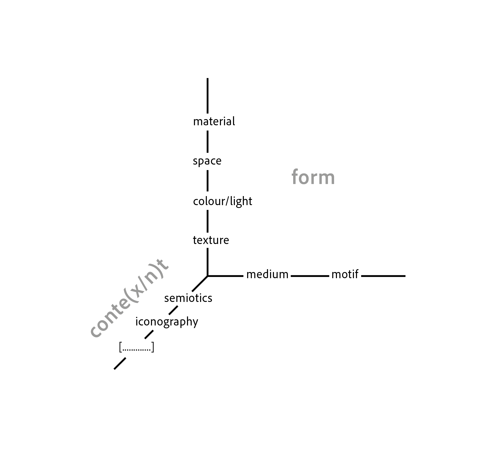

# Intro

Vision and Depiction celebrates form as interface between art and science. It is a conference about how to depict form, and how form is perceived. But it is also a conference about the many connections that form has with the content and context of pictures. Thirdly, it is a conference about the interaction between the physical medium of pictures, and the mental presentations it gives rise to, i.e. about the relation between medium and motif.

Curious about the previous edition? Check out what happened last time: [Vision and Depiction 2024 online program](program2024.html) with a selection of video recordings.

The next Vision and Depiction will happen from 4 to 6 February 2026 in Delft. We are currently starting up the organisation, feel free to reach out if you have questions.

# Timeline
- Abstract submission opens: 15 October 2025
- Abstract submission closes: 15 November 2025
- Notification of Acceptance: 30 November 2025
- Early bird registration: 15 December 2025
- Conference: 4-6 February 2026

# Contact

# Organizing committee
Maarten Wijntjes 
Catelijne van Middelkoop 
Nim Goede 
Mark Sypesteyn 
