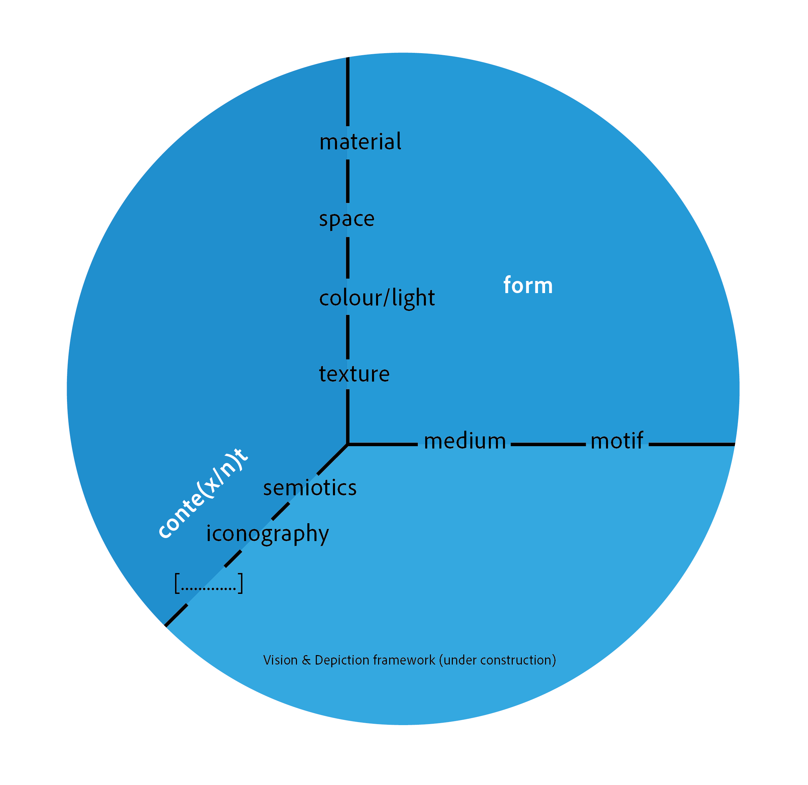

# Intro
After two conferences The Skin of Things [2018](https://theskinofthings.github.io) and [2021](https://theskinofthings2021.github.io) that focussed on the depiction and perception of *material properties*, we decided to broaden the scope and organise **Vision and Depiction 2024**. It will take place in the lovely Dutch city of *Delft* from *7-9 February 2024*.

# About
This conference about pictorial production and perception aims to bring artists, designers, and scientists together to discuss various overlapping themes. These themes are based on our Vision and Depiction framework that has been developed while teaching about perception and communication. The framework describes the form and content of pictures. For now, we envision four main talk sessions centring around the four pictorial factors: texture, light/color, space, and material. Within these themes, we hope to evoke discussions on both the medium and representation but also in the directions of semiotics and iconography and further contextual contemplation.

# Target audience
We hope to attract a wide variety of scientists and artists. Here is an indication of potential disciplines that we envision.
- **Artists/designers:** Every artist/designer who is involved in visual culture either be reflecting upon, or experimenting with various forms and techniques of visual communication.
- **Vision science:** Researchers involved in visual perception related to the arts or more specifically to any of the Vision and Depiction framework elements.
- **Art history:** Scholars from (technical) art history investigating various aspects of motifs and/or medium. Also subjects such as style, and the mystery of mastery are relevant.
- **Computer science:** Computer vision and graphics has a long tradition of image synthesis that has clear parallels with the longer art history of depiction.
- **Digital humanities:** With the emergences of large open access image databases, a new field has emerged around the computational analysis of image collections and more recently also using AI both as analytical tools but also as subject matter.
- **Archeology and Anthropology:** The usage of images, pictorial traditions and conventions throughout various (historical) cultures.

# Target topics
We have a top-down idea about our ideal set op topics, although that will depend critically on what submissions we attract. In realty the program will likely be also driven by a bottom up approach where we cluster the available contributions into meaningful units. But before reality hits, these topics would ideally serve as pillars:

- **Texture:** Although the word 'texture' may have different meanings in different disciplines, *the structure of patterns* seems a universally fascinating. The 3D texture of paint, generative algorithms replicating natural phenomena, ornamental patterns at large, traces of various media (such as half tone dots or etch lines), interactions between textures in the medium and textures in the representation, texture bias in deep neural networks, these are just a few examples that bring together vision and depiction.
- **Color and Light:**
- **Space:**
- **Material:**

# Location and venue
The conference will take place in the city of Vermeer, Delft, which is both a unique historical city in the Netherlands and hosts the Delft University of Technology. The city easy to reach by bike, car and train, and is a 38 minutes train ride away from Schiphol. Everything is so close by that in most cases you do not even need a bike. When walking from the train station to the campus you actually pass by the place Vermeer painted [View on Delft](https://www.mauritshuis.nl/en/our-collection/artworks/92-view-of-delft/), although it looks a bit different nowadays.
The main conference will be on campus, but we may have some activities elsewhere.

# Timeline
- Abstract submission deadline: 15 November 2023
- Notification of Acceptance: 30 November 2023
- Early bird registration: 1 December 2023

# Registration

We will charge a registration fee to cover costs such as catering and facilities, but will try to keep it as low as possible. The registration fee will be waived for participating artists, although the number will be limited.

# Organizing committee
Maarten Wijntjes 
Catelijne van Middelkoop 
