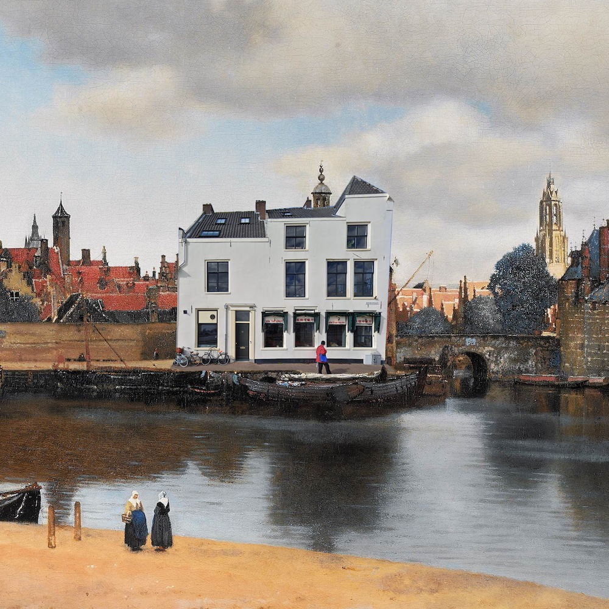

# Program
<!--This program is preliminary and aims to give an overall impression of what to expect. We may shuffle a bit before we cast to schedule into its final form.

We added personal links to provide some context but if you don't like it or want to change it please contact us.-->

# Program at a glance:
[Wednesday](#wednesday) 
12:00 Registration open
13:00 Opening sessions 
13:15-14:30 [Texture](#texture) 
14:30-15:00 Coffee 
15:00-16:30 [Knowing through making](#knowing) 
16:30-16:45 Break 
16:45-18:15 [Keynote collective](#keynote1) 
18:15 [Opening reception](#openingreception)

[Thursday](#thursday) 
8:45-10:30 [Space and motion](#space) 
10:30-11:00 Coffee 
11:00-12:30 [Keynote collective](#keynote2) 
12:30-13:30 Lunch 
13:30-15:30 [Posters](#posters) 
15:00:15:30 Coffee 
15:30-17:00 [Materials & Materiality](#materials) 
17:00-17:15 Short break 
17:15-18:45 [Keynote collective](#keynote3) 
19:30 [Conference dinner](#dinner)

[Friday](#friday) 
9:00-10:30 [Colour and light](#colour) 
10:30-11:00 Coffee 
11:00-12:30 [Keynote collective](#keynote4) 
12:30-13:30 Lunch 
13:30-15:00 [Workshop](https://visionanddepiction.github.io/#workshop) 
15:00:16:00 Coffee & matchmaking / discussions in groups 
16:00-17:45 [The aesthetic gaze](#aesthetic) 
17:45-18:15 Closing discussion 
18:30- [Farewell reception](#closingreception) 

# Program in detail:

## Wednesday
### 13:00 Opening session

### 13:15-14:30 Texture {#texture}
- Designing Knowledge: Theoretical Considerations on Information and Decoration in Prehistory	 - [Dale Daykin](https://www.linkedin.com/in/dale-daykin-a2822111a/?originalSubdomain=uk)
- Eidolons …	- [Jan Koenderink](https://scholar.google.com/citations?user=lxW3wvMAAAAJ&hl=en)

- The fundamental building blocks of human texture perception. - [Robert Kentridge](https://www.durham.ac.uk/staff/robert-kentridge/)
- Material perception across different media - comparing perceived attributes in paintings and engravings	[Yuguang Zhao](https://www.linkedin.com/in/yuguangzhao/?originalSubdomain=nl)

### 14:30-15:00 Coffee

### 15:00-16:30 Knowing through making {#knowing}
- Analogies: When I Draw a Song for a Film - [Dejan Grba](https://dejangrba.org/dejan-grba/en/index.php)
- Depicting Truth through Deceit: the role of the faux altarpiece in the Portuguese mural painting - [Patricia Monteiro](https://lisboa.academia.edu/PatriciaMonteiro)
- Against Repoussoir: An Exploration of Knowledge through Making - [Catelijne van Middelkoop](Catelijne van Middelkoop)
- Drawings as Cognitive Artefacts [Jens Dam Ziska](https://www.jensdamziska.com)
- Critical Neuroart: A Neurocultural Reading of Robert Morris' Self-Portrait (EEG) - [Nim Goede](https://uva.academia.edu/NimGoede)

### 16:30-16:45 Break

### 16:45-18:15 Keynote collective I {#keynote1}
- [Ann-Sophie Lehmann](https://www.rug.nl/staff/a.s.lehmann/?lang=en) -Sketchy, Tiny, Black-and-White. An Ecological Approach to Depicting the World in 17th Century Visual Education.
- [Evelina Domnitch + Dmitry Gelfand](http://www.portablepalace.com) - Trapping the Objectless

### 18:15 Opening reception {#openingreception}
We'll have welcome drinks, enjoy great food creations from [Coco Dining](https://www.instagram.com/coco_dining_amsterdam) and experience a performance by keynote speakers [Evelina Domnitch + Dmitry Gelfand](http://www.portablepalace.com), all in the main hall of [Industrial Design Engineering](https://www.tudelft.nl/en/ide/).

## Thursday
### 8:45-10:30 Space and motion {#space}
- Motion and layout depiction using 2D/3D animation tools - 	Melvin Even
- Representing the manifold gaze of architectural spaces - 	[Eugene Han](https://aad.lehigh.edu/eugene-han)
- “Framing” the landscape. Movement, Landscape and Cinema.	Assistant Professor - [Vitor Gomes](https://www.uevora.pt/pessoas?id=4793)
- Freehand sketching of 3D shapes and implications for computer-aided design; an overview of a multi-disciplinary collaboration - [Adrien Bousseau](http://www-sop.inria.fr/members/Adrien.Bousseau/)
- Motion as key factor in the perception of space -	[Dominik Lengyel](https://www.b-tu.de/fg-architektur-und-visualisierung)

### 10:30-11:00 Coffee

### 11:00-12:30 Keynote collective {#keynote2}
- [Tim Jenison](https://en.wikipedia.org/wiki/Tim%27s_Vermeer) - An Optical View of Delft
- [Janne Schimmel](https://janneschimmel.com)

### 12:30-13:30 Lunch

### 13:30-15:00 Posters {#posters}

1. Neanderthal Art and the Problem of Ethnocentrism - [Tullio Abruzzese](https://www.linkedin.com/in/tullio-abruzzese-2935ba5a/?originalSubdomain=nl)
1. 3D printing the Mixtec skull: The opportunities and challenges technology provides in discussing ethical issues surrounding contested heritage in a co-creative, inclusive, and responsible way. - [Liselore Tissen](https://www.universiteitleiden.nl/medewerkers/liselore-tissen#tab-1)
1. A Watermark Recognition System: an Approach to Matching Similar Watermarks - [Vladimir Petkov](https://graphics.tudelft.nl/martin-skrodzki/)
1. Does Camera Movement Move Us, or: How embodied is Film Viewing? - [Lisa-Maria van Klaveren](https://research.rug.nl/en/persons/lisa-maria-klaveren-van)
1. Learning variable shape footprints from brushstroke models - [Yuchen Wu](https://researchportal.bath.ac.uk/en/persons/yuchen-wu)
1. Exploring infinite spaces from finite confinements - [Scott Jochems]()
1. Image Complexity vs Aesthetic Appreciation in Abstract Art - [Maartje Raijmakers](https://www.uva.nl/profiel/r/a/m.e.j.raijmakers/m.e.j.raijmakers.html?cb)
1. The Picture Stares Back - [Andrea J. van Doorn](https://scholar.google.com/citations?user=_6VnqIwAAAAJ&hl=nl)
1. Image-Works: An Exhibition Study Focused on the Interactions between the Medium of Depiction and (Re-)Presentation in Vision - [Johan Wagemans](https://gestaltrevision.be/home)
1. Eyes, Still-Lifes & Eidolons \[Dash] Effects of Colour and Object information on Eye Movements - [Doris Braun](https://www.allpsych.uni-giessen.de/doris/)
1. Painterly Style Transfer with Learned Brush Strokes - [Yuchen Wu](https://researchportal.bath.ac.uk/en/persons/xiaochang-liu)
1. Lifelike Butterflies Painted with Oil and Colourful Dust - [V.E. Mandrij](https://www.linkedin.com/in/v-e-mandrij-a28b3ba5/?originalSubdomain=nl)
1. Mapping visual attention to important and unimportant details in art photographs and paintings - [Maarten Leemans](https://www.linkedin.com/in/maarten-leemans-317547210/)
1. Illusory colours in monocular rivalry - [Leone Burridge](https://leoneburridge.com)
1. Artworks -flat packed lunch - [Eve cromwell](https://evelyncromwell.weebly.com)
1. A love letter and its secret author.
Vermeer's "Girl reading a letter at an open window" as a thought-vision of the viewer - [Martin Lottermoser](https://www.linkedin.com/in/martin-lottermoser-a475b716a/?originalSubdomain=de)
1. Assessing material appearance based on image color entropy - [Masataka Sawayama](https://www.mswym.com)
1. Rethinking Realism: an interdisciplinary exploration of Upper Palaeolithic Venus Figurines through eye-tracking methodologies - [Sam Hirst]()
1. Hue-Specific Effects of Lighting on Perceived Atmosphere - [Giulio Palma](https://www.linkedin.com/in/giulio-palma-44827714b/?originalSubdomain=uk)
1. The influence of the variations in daylight on the perception of colour - [Catherine Toulouse](https://www.lengyeltoulouse.com)
1. Reconstructing Maarten van Heemskerck's flesh paint - [Lieve d'Hont](https://www.linkedin.com/in/lieve-d-hont-a0527642/?originalSubdomain=nl)
1. Presentation of artworks - [Jenny Mc Namara](https://jennymcnamara.com)
1. Picture-surface, picture-subject: an empirical assessment of Wollheim´s theory of Twofoldness - [Anna Miscena](https://kunstgeschichte.univie.ac.at/ueber-uns/mitarbeiterinnen/projektmitarbeiterinnen/miscena-anna/)
1. What words do we use to describe colour-changing (iridescent) surfaces? - [Li Shiwen](https://www.linkedin.com/in/lshiwen/?originalSubdomain=uk)
1. Cast shadows enhance pictorial depth perception of volumetric shapes - [Robert Volcic](https://nyuad.nyu.edu/en/academics/divisions/science/faculty/robert-volcic.html)

### 15:00:15:30 Coffee

### 15:30-17:00 Materials & Materiality {#materials}
- Solid and fleeting. Depicting material stories in a materials collection.	[Sarah Kaiser](https://www.burg-halle.de/hochschule/information/personen/p/sarah-kaiser/) and [Andi Wagner](https://andiwagner.de)
- Free Exploration of Materiality and Space Across Three Contemporary Art Exhibitions	[Christopher Linden](https://www.researchgate.net/profile/Christopher-Linden-3)
- Pieter Bruegel's Blind Figures, Visuality and the Human Position	[Hannah De Corte](http://www.hannahdecorte.com)
- Material Experience Framework in Cultural Heritage -	[Willemijn Elkhuizen](https://www.tudelft.nl/io/over-io/personen/elkhuizen-ws)
- Tintoretto's Texture: An Experiment in Non-Contact 3D Laser Scanning - [Cleo Nisse](https://arthistory.columbia.edu/content/cleo-nisse)

### 17:00-17:15 Short break

### 17:15-18:45 Keynote collective {#keynote3}
- Paul Pettitt - From body marks to figurative art: what we know about the Ice Age evolution of human visual culture
- Persijn Broersen and Margit Lukacs - Vision & Fiction, Depiction & Deception; The Place of Image

### 19:30 Conference dinner {#dinner}

We will have our conference dinner at [Lychee restaurant](https://lycheedelft.com/home), one of the most popular places in town! Besides awesome food, you can look out the window and imagine Vermeer (and Tim!) viewing in your direction.

## Friday
### 9:00-10:30 Colour and light {#colour}
- The Colours of Ugliness	- [Anya Hurlbert](https://www.ncl.ac.uk/psychology/people/profile/anyahurlbert.html)
- Form, material, light and meaning of the reliefs of Schoonhoven and their photographs of Wolleh -	[Sylvia Pont](https://www.tudelft.nl/io/over-io/personen/pont-sc)
- How to paint a smell. The use of cross-modal correspondence between smell and vision in art and design. -	[Francesca Di Cicco](https://www.uu.nl/staff/FdiCicco)
- The appeal of Ganzfeld art: a matter of losing and regaining grip on depth? -	[Eleftheria Pistolas](https://www.linkedin.com/in/eleftheria-pistolas-02301313a/)
- The interplay between colour and value - [Jan Willem Hoftijzer & Mark Sypesteyn](http://www.delftdesigndrawing.com)

### 10:30-11:00 Coffee

### 11:00-12:30 Keynote collective {#keynote4}
- [Hannah Smithson](https://www.psy.ox.ac.uk/people/hannah-smithson) - From Pixels to Perception: Appreciating the structure in visual signals of material properties.
- [Joost Swarte](https://www.joostswarte.nl)

### 12:30-13:30 Lunch

### 13:30-15:00 Workshop

### 15:00:16:00 Coffee & matchmaking / discussions in groups

### 16:00-17:45 The aesthetic gaze {#aesthetic}
- Flattened Intensities, Intensified Flatness : Aesthetic Appreciation of Contemporary Abstract Art Changes as a Result of Context Information -	[Stefanie De Winter](https://www.stefaniedewinter.com)
- Disentangled Aesthetics – In Art Portraits Global Image Properties Predict the Beauty of the Painting but not the Attractiveness of the Sitter	[Gregor Hayn-Leichsenring](https://scholar.google.com/citations?user=ZnmuzZIAAAAJ&hl=en)
- On Mondrian, meaning and balance. -	[Jeroen Stumpel](https://www.uu.nl/medewerkers/JFHJStumpel)
- Seeing and Sensing	- [Yanai Toister](https://yanaitoister.com)
- A Semiotics of Perspective and Vision in Donatello’s Relief Sculpture	 [David Drogin](https://www.fitnyc.edu/creative-nexus/faculty/directory/drogin-david.php)

### 17:45-18:15 Closing discussion

### 18:30 - Farewell reception {#closingreception}
Very close to the train station and opposite to musuem Prinsenhof we reserved a cosy space at [Bar/Baar](https://barbaar.nl) where we will have some farewell food and drinks.
