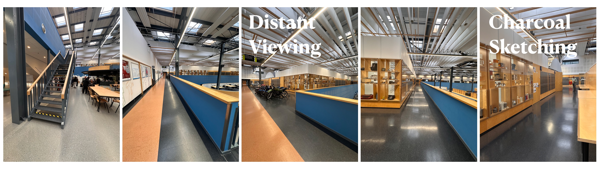

# Program

## Wednesday 4 February

### 13:00 Registration opens

### 13:30 Introduction

### 13:45 The aesthetic gaze (in context)
- [Christopher Linden](https://gestaltrevision.be/news/team_members/christopher-linden/) – [**Eye Tracking Perception of Traditional, Impressionist, and Cubist Still Life Paintings at the Manchester Art Gallery**](abstracts.html#eye-tracking-perception-of-traditional-impressionist-and-cubist-still-life-paintings-at-the-manchester-art-gallery) - [_recording_](https://collegerama.tudelft.nl/Mediasite/Channel/ide-vision-and-depiction-ii/watch/7ce662c4603044aaa7ced31ee5c00b8c1d?sortBy=oldest)
- [Rajat Ravi Rao](https://www.universiteitleiden.nl/en/staffmembers/rajat-ravi-rao#tab-1) – [**Who Appreciates Ambiguity in Art?**](abstracts.html#who-appreciates-ambiguity-in-art) - [_recording_](https://collegerama.tudelft.nl/Mediasite/Channel/ide-vision-and-depiction-ii/watch/7e26c07860004774b403e9048a72075e1d?sortBy=oldest)
- [Xingyu Long](https://kunstgeschichte.univie.ac.at/personen/wissenschaftliche-mitarbeiterinnen/xingyu-long/) – [**Visions of Veins: Eye-Tracking the Irregular Symmetries of Book-Matched Marble**](abstracts.html#visions-of-veins-eye-tracking-the-irregular-symmetries-of-book-matched-marble) - [_recording_](https://collegerama.tudelft.nl/Mediasite/Channel/ide-vision-and-depiction-ii/watch/2092969aee4846549f19009b2e356e471d?sortBy=oldest)
- [David Romand](https://univ-amu.academia.edu/DavidRomand) – [**Enlivening Beautiful Forms. New Insights into Empathy and the Aesthetics of the Visual Arts**](abstracts.html#enlivening-beautiful-forms-new-insights-into-empathy-and-the-aesthetics-of-the-visual-arts) - [_recording_](https://collegerama.tudelft.nl/Mediasite/Channel/ide-vision-and-depiction-ii/watch/7965150e61044830b7868313af87f6661d?sortBy=oldest)

### 15:00 Coffee

### 15:20 Keynote
- [Antye Guenther](https://aguenth.de) - [**Spilling the Tea Ceremony: On Becoming DATA DIVA**](abstracts.html#spilling-the-tea-ceremony-on-becoming-data-diva) - [_recording_](https://collegerama.tudelft.nl/Mediasite/Channel/ide-vision-and-depiction-ii/watch/c11cfeefb07d41e882707c100c0666a91d?sortBy=oldest)
- Intermezzo - [_recording_](https://collegerama.tudelft.nl/Mediasite/Channel/ide-vision-and-depiction-ii/watch/bdfa62d411cb41fb81775f53994b05641d?sortBy=oldest)

### 16:30 Break

### 16:45 Knowing through making
- [Persijn Broersen and Margit Lukacs](https://www.pmpmpm.com) – [**Novi Mundi, A Journey of Discovery Through Uncharted Human Realms**](abstracts.html#novi-mundi-a-journey-of-discovery-through-uncharted-human-realms) [_recording_](https://collegerama.tudelft.nl/Mediasite/Channel/ide-vision-and-depiction-ii/watch/64391b4341564092a6991da42e4733a21d?sortBy=oldest)
- [Ilaria Paolucci](https://phd.uniroma1.it/web/ILARIA-PAOLUCCI_nP1580685_IT.aspx) – [**In the artist's eye: manuals on painting techniques, written by artists for artists as a tool for understanding the creative process**](abstracts.html#in-the-artists-eye-manuals-on-painting-techniques-written-by-artists-for-artists-as-a-tool-for-understanding-the-creative-process)  - [_recording_](https://collegerama.tudelft.nl/Mediasite/Channel/ide-vision-and-depiction-ii/watch/c07be8f7d11e4d74af2bac15cd47e77b1d?sortBy=oldest)
- [Ana Domingues](https://www.artsthread.com/portfolios/what-do-we-see-with-our-eyes-closed--ayahuasca)	 - 	[**Reconstructing the Imagetic Brain: Speculative Design and Visual Image Reconstruction of Closed-Eye Visualisations**](abstracts.html#reconstructing-the-imagetic-brain-speculative-design-and-visual-image-reconstruction-of-closed-eye-visualisations) - [_recording_](https://collegerama.tudelft.nl/Mediasite/Channel/ide-vision-and-depiction-ii/watch/d9bfb8cf4e5c4ae69009cdcffd0f43081d?sortBy=oldest)
- [Catelijne van Middelkoop](https://www.linkedin.com/in/catelijne-van-middelkoop-8a15aa57/?originalSubdomain=nl) – [**From Seeing to Unseeing: Expanding the Vision and Depiction Framework Through Making**](abstracts.html#from-seeing-to-unseeing-expanding-the-vision-and-depiction-framework-through-making) - [_recording_](https://collegerama.tudelft.nl/Mediasite/Channel/ide-vision-and-depiction-ii/watch/d9bfb8cf4e5c4ae69009cdcffd0f43081d?sortBy=oldest)

### 18:00 Reception @IDE hall (conference venue)

## Thursday 5 February

### 9:00 Medium and Motif
- [Flip Phillips](https://flipphillips.com) – [**This is not an AI generated title**](abstracts.html#this-is-not-an-ai-generated-title) - [_recording_](https://collegerama.tudelft.nl/Mediasite/Channel/ide-vision-and-depiction-ii/watch/56b554764b424b0b9fa95863745a566b1d?sortBy=oldest)
- [Piera Riccio](https://www.linkedin.com/in/piera-riccio-96649211a/) – [**Iconography of the Digital Self: From Beauty Filters to AI Portraits**](abstracts.html#iconography-of-the-digital-self-from-beauty-filters-to-ai-portraits) - [_recording_](https://collegerama.tudelft.nl/Mediasite/Channel/ide-vision-and-depiction-ii/watch/94cc059459f244eba09425c8aaab2d901d?sortBy=oldest)
- [Arthur Crucq](https://www.universiteitleiden.nl/en/staffmembers/arthur-crucq#tab-2) – [**The agency of form and material: from bubble wrap to art**](abstracts.html#the-agency-of-form-and-material-from-bubble-wrap-to-art) - [_recording_](https://collegerama.tudelft.nl/Mediasite/Channel/ide-vision-and-depiction-ii/watch/5fc70a6b883c40569165f85a4f3982191d?sortBy=oldest)
- [Hanna Brinkmann](https://www.donau-uni.ac.at/en/university/organization/employees/person/4295324511) – [**One Motif, Four Media: What Happens to Art Experience Across Medialities?**](abstracts.html#one-motif-four-media-what-happens-to-art-experience-across-medialities) - [_recording_](https://collegerama.tudelft.nl/Mediasite/Channel/ide-vision-and-depiction-ii/watch/bd137b5d3d474e678c5af871d81d09c31d?sortBy=oldest)

### 10:15 Coffee

### 10:35 Keynotes
- [Joris van Gastel](https://www.khist.uzh.ch/en/institut/staff/privatdozents/gastel.html) - [**_Natura Pictorum_: Bruegel’s _Macchia_ and the Ecology of Landscape**](abstracts.html#gastel)<!--](abstracts.html#natura-pictorum-bruegels-macchia-and-the-ecology-of-landscape)-->
- [Jean-Baptiste Maitre](https://jbmaitre.com) and [Dina Danish](https://dinadanish.com) – [**Material Twins, Infrared Strangers: Reconstructing Egyptian Blue in Egypt and the Netherlands**](abstracts.html#material-twins-infrared-strangers-reconstructing-egyptian-blue-in-egypt-and-the-netherlands)  - [_recording_](https://collegerama.tudelft.nl/Mediasite/Channel/ide-vision-and-depiction-ii/watch/2211dddfd9fc4e17921bb2272d7b2b821d?sortBy=oldest)

### 12:05 Posters and lunch

Not your regular poster session: demo's, artworks and, indeed, posters!

1. [Dejan Grba](https://dejangrba.org) – [**Study 7/0: Locus Erroneum**](abstracts.html#study-70-locus-erroneum)
1.	[Chao-Shan Hsu](https://kunstgeschichte.univie.ac.at/personen/projektmitarbeiterinnen/hsu-chao-shan/), Xingyu Long, Raphael Rosenberg	 - 	[**Cultural Differences in Gaze Patterns over Paintings and Photographs**](abstracts.html#cultural-differences-in-gaze-patterns-over-paintings-and-photographs)
1.	[Leone Burridge](https://leoneburridge.com)	 - 	[**Illusory Colours in monocular rivalry, new paintings.**](abstracts.html#illusory-colours-in-monocular-rivalry-new-paintings)
1.	[Eftychia Stamkou](https://www.linkedin.com/in/eftychia-stamkou-79651980/?originalSubdomain=nl), Selina Khan, Matteo Tafuro, Nanne van Noord	 - 	[**The Shape of Gender: How Context Becomes Form in Artistic Representation**](abstracts.html#the-shape-of-gender-how-context-becomes-form-in-artistic-representation)
1.	[Sylvia Pont](https://www.tudelft.nl/io/over-io/personen/pont-sc), Katja Doerschner	 - 	[**Likin art; Light induced kinetics on art**](abstracts.html#likin-art-light-induced-kinetics-on-art)
1.	[Dantong Qin](https://research.tudelft.nl/en/persons/dq-dantong/), Alessandro Bozzon, Qinlin Liu, Yike Guo, Pan Wang	 - 	[**Process-Aware Robotic Painting: A Closed-Loop Framework for Human–AI Collaborative Creation**](abstracts.html#process-aware-robotic-painting-a-closed-loop-framework-for-humanai-collaborative-creation)
1.	Celine Aubuchon, Roland W Fleming	 - 	[**Cloth between the wrinkles: exploring information propagation in surface perception**](abstracts.html#cloth-between-the-wrinkles-exploring-information-propagation-in-surface-perception)
1.	Bade Kilic, Zsofia Pilz, Francesco Walker, Mariska Kret	 - 	[**Through a Child's Eyes: Exploring Gaze Patterns on Albers' Homage to the Square**](abstracts.html#through-a-childs-eyes-exploring-gaze-patterns-on-albers-homage-to-the-square)
1.	[Jean Basset](https://jbasset.github.io), Pierre Bénard, Pascal Barla	 - 	[**How smear frames improve fast motion legibility**](abstracts.html#how-smear-frames-improve-fast-motion-legibility)
1.	Yuexi (Betty) Zhu, Zsofia Pilz, Maarten Wijntjes	 - 	[**The Influence of Iconographic and Formalistic Instruction on Art Viewing Behavior**](abstracts.html#the-influence-of-iconographic-and-formalistic-instruction-on-art-viewing-behavior)
1.	[Océane Tilman](https://www.linkedin.com/in/océane-tilman-620349190/) , Selin Isik,  Zsofia Pilz, Francesco Walker  - 	[**Investigating the Effect of Child-Written Descriptions Using Eye-Tracking at the Groninger Museum**](abstracts.html#investigating-the-effect-of-child-written-descriptions-using-eye-tracking-at-the-groninger-museum)
1.	[Karl R. Gegenfurtner](https://www.allpsych.uni-giessen.de/karl/), Andrea van Doorn, Doris Braun, Jan Koenderink	 - 	[**A metric of color space for science, industry and art**](abstracts.html#a-metric-of-color-space-for-science-industry-and-art)
1.	[Doris Braun](https://www.allpsych.uni-giessen.de/doris/), Vanessa Kremer, Katja Dörschner	 - 	[**Being Malevich II: Color, Balance, Dynamic and Liking in Suprematist Compositions**](abstracts.html#being-malevich-ii-color-balance-dynamic-and-liking-in-suprematist-compositions)
1.	[Cathalijne Postma, Debbie van Berkel, Jojanneke Postma](https://kasboek.org)	 - 	[**Latent Space, Through the eyes of the algorithm**](abstracts.html#latent-space-through-the-eyes-of-the-algorithm)
1.	[Mark Sypesteyn](https://www.marksypesteyn.com)	 - 	[**Depicting human figures in line: comparing expert vs. beginner decision making in tracing a figure from photo reference**](abstracts.html#depicting-human-figures-in-line-comparing-expert-vs-beginner-decision-making-in-tracing-a-figure-from-photo-reference)
1. [Cehao Yu](https://www.linkedin.com/in/cehao-yu-13b16a59/) and [Müge Cavdan](https://www.linkedin.com/in/müge-cavdan-b3357a48) - [**Blue-Induced Temporal Dilation in Art Viewing**](abstracts.html#blue-induced-temporal-dilation-in-art-viewing)
1.  [Omer van Soldt](https://studio-rasab.com/about) - **Apparent Motion, Perceived Stillness: The Self at 50Hz**<!--](abstracts.html#apparent-motion-perceived-stillness-the-self-at-50hz)-->
1. 	[Yannis Michos](https://www.instagram.com/yannis.michos/) - **Aliased Geometries: Towards a nonviolent Trance 1.0**<!--](abstracts.html#aliased-geometries-towards-a-nonviolent-trance-10)-->
1. 	Yujin Jo - [**Connection Justice Map Patterns Knowledge Data Grid Context By-product Absolute exist**](abstracts.html#yujin)<!--](abstracts.html#connection-justice-map-patterns-knowledge-data-grid-context-by-product-absolute-exist)-->
1. [Anna Miscenà](https://kunstgeschichte.univie.ac.at/en/staff/academic-personnel/miscena-anna/) – [**Style Needs Time: Temporal Dynamics in the Recognition of Stylistic Differences in Painting**](abstracts.html#style-needs-time-temporal-dynamics-in-the-recognition-of-stylistic-differences-in-painting)
1. Nara Lee - [**Through Kawaii Eyes: Interventions for Revealing Genre Painting Processes for Novice Museum Visitors**](abstracts.html#nara)

### 14:45 Colour and Light
- [Jeroen Stumpel](https://www.uu.nl/staff/JFHJStumpel) - [**Seurat’s dots and the myth of optical mixing**](abstracts.html#seurat) - [_recording_](https://collegerama.tudelft.nl/Mediasite/Channel/ide-vision-and-depiction-ii/watch/0007c6eb7ed240f8b56bfb70e3dd069f1d?sortBy=oldest)
- Shiwen Li – [**The colour of iridescent samples at every moment of a bumblebee’s flight**](abstracts.html#the-colour-of-iridescent-samples-at-every-moment-of-a-bumblebees-flight) - [_recording_](https://collegerama.tudelft.nl/Mediasite/Channel/ide-vision-and-depiction-ii/watch/ddd3dd4e82634f56a98e3cac89f53c801d?sortBy=oldest)
- [Nikola Zmijarević](https://nikolazmijarevic.com/) – [**Gold, Reflection and Glare: The Paintings of Lovro Artuković and The Logic of Paradox in Mimesis**](abstracts.html#artukovic-gold-reflection) - [_recording_](https://collegerama.tudelft.nl/Mediasite/Channel/ide-vision-and-depiction-ii/watch/a83436eeb48f4df2b48011833eada0681d?sortBy=oldest)
- [Beatrice Sartori](https://www.unibo.it/sitoweb/beatrice.sartori6/en) – [**The Softness of Screens: Liquid Visual Culture in Contemporary Displays**](abstracts.html#the-softness-of-screens-liquid-visual-culture-in-contemporary-displays) - [_recording_](https://collegerama.tudelft.nl/Mediasite/Channel/ide-vision-and-depiction-ii/watch/e1f068555dbf4c3cb71e1880c0b53f451d?sortBy=oldest)
- [Stefanie De Winter](https://www.stefaniedewinter.com) – [**Presenting IRECONA: An Interdisciplinary Method for Appearance-Based Reconstruction of Degraded Color Field Paintings**](abstracts.html#presenting-irecona-an-interdisciplinary-method-for-appearance-based-reconstruction-of-degraded-color-field-paintings) - [_recording_](https://collegerama.tudelft.nl/Mediasite/Channel/ide-vision-and-depiction-ii/watch/64839a557b224175b4e761b3010aac931d?sortBy=oldest)

### 16:15 Coffee

### 16:35 Keynote
- [Eleftheria Pistolas](https://gestaltrevision.be/news/team_members/131/) – [**Inside-out dynamics of art perception through a multi-method lens**](abstracts.html#inside-out-dynamics-of-art-perception-through-a-multi-method-lens) - [_recording_](https://collegerama.tudelft.nl/Mediasite/Channel/ide-vision-and-depiction-ii/watch/5253df849fbb4a919b2d780f1cb741101d?sortBy=oldest)

### 17:10 - 18:25 Pictorial space and movement
- [Maarten Coëgnarts](https://www.kuleuven.be/wieiswie/en/person/00133685) – [**How Rhythms Shape Meanings in Cinema: A Videographic Gestalt Approach**](abstracts.html#how-rhythms-shape-meanings-in-cinema-a-videographic-gestalt-approach) - [_recording_](https://collegerama.tudelft.nl/Mediasite/Channel/ide-vision-and-depiction-ii/watch/d2393ea4b1874e6d8c9447f0aab8f2c61d?sortBy=oldest)
- [Valentine Bernasconi](https://www.valentinebernasconi.ch) – [**Pictorial forms in movement**](abstracts.html#pictorial-forms-in-movement) - [_recording_](https://collegerama.tudelft.nl/Mediasite/Channel/ide-vision-and-depiction-ii/watch/558743f8e3674b7384161ac0e0b97ef01d?sortBy=oldest)
- [Marvin de Jong](https://m-a-r-v-i-n.com/) – [**Controlled Instability: Graphic Design as Embodied Interaction in Real-Time Systems**](abstracts.html#controlled-instability-graphic-design-as-embodied-interaction-in-real-time-systems) - [_recording_](https://collegerama.tudelft.nl/Mediasite/Channel/ide-vision-and-depiction-ii/watch/c5b6651b0cfb4c8680490b757bc6548e1d?sortBy=oldest)
- Doroteja Ivanec – [**Diego Velázquez: Image within an Image**](abstracts.html#diego-velazquez-image-within-an-image) - [_recording_](https://collegerama.tudelft.nl/Mediasite/Channel/ide-vision-and-depiction-ii/watch/5a5962c385f5489ea2fec624d82206751d?sortBy=oldest)

### Conference dinner @['t Postkantoor](https://postkantoordelft.nl) (directions via [google maps](https://maps.app.goo.gl/Hmjk7PwVVazHfpHe9))

## Friday 6 February

### 9:00 Materials and Materiality
- [Filipp Schmidt](https://www.allpsych.uni-giessen.de/filipp/) – [**Material perception in context**](abstracts.html#material-perception-in-context) 
- [Marte Sophie Meessen](https://www.ru.nl/personen/meessen-m) – [**Natural and unnatural representation of gravity in art: an eye-tracking study**](abstracts.html#natural-and-unnatural-representation-of-gravity-in-art-an-eye-tracking-study)
- Pierre Billaud – [**Material appearance in stylized representations: the case of design sketches**](abstracts.html#material-appearance-in-stylized-representations-the-case-of-design-sketches) - [_recording_](https://collegerama.tudelft.nl/Mediasite/Channel/ide-vision-and-depiction-ii/watch/58b2d4f4ea664470a3341d8d2adb65711d?sortBy=oldest)
- [Jiri Filip](https://staff.utia.cas.cz/filip/) – [**Measuring Directional Appearance of Shiny Fabrics Using an Extended Flop Index**](abstracts.html#measuring-directional-appearance-of-shiny-fabrics-using-an-extended-flop-index) - [_recording_](https://collegerama.tudelft.nl/Mediasite/Channel/ide-vision-and-depiction-ii/watch/df305da1b88d46409bb673f0d784a10b1d?sortBy=oldest)

### 10:15 Coffee

### 10:35 Keynote
- [Pascal Barla](https://www.labri.fr/perso/barla/blog/) – **Specular Flow Structure for Vision and Depiction**  - [_recording_](https://collegerama.tudelft.nl/Mediasite/Channel/ide-vision-and-depiction-ii/watch/df38d6173986420cbe09fa90d202df141d?sortBy=oldest)
- Sam Hirst –  **Perception and Ice Age art: applying visual psychology to the study of palaeolithic female figurines**  - [_recording_](https://collegerama.tudelft.nl/Mediasite/Channel/ide-vision-and-depiction-ii/watch/214ef334d02048a4933d5cfaefb0e8041d?sortBy=oldest)

### 11:55 Lunch

### 13:00 Workshop

During the workshops we will put Vision and Depiction in practice by examining two vastly different activities: distant viewing and charcoal sketching.

 _Distant viewing_ refers to the large-scale analysis of visual culture through a comparative lens, often employing computational methods to relate visual features to contextual metadata. You will be introduced to some basic techniques for which we will use google colab notebooks. You will need a laptop (preferable with a google account but if you hate big tech we’ll figure something out) and if you happen to have an interesting digital image collection you can use that during the workshop. 

_Charcoal sketching_ obviously refers to sketching with charcoal sticks but more generally refers to a sketching process that is very scale sensitive. The charcoal strokes are relatively massive, you cannot render fine detail, which requires a different way of viewing the object you want to depict. For this workshop you do not need a laptop, moreover you may want to leave your pristinely white clothes in your suitcase ;). 

You do not need to sign-up for the workshops, you will be directed by the organizers to the two studios where it will take place. If you want to use these two hours to network with your attendees that is also absolutely fine.

Here is the route to the studio's:

### 14:50 Process & (human vs computational) processing
- [Tomas Vandecasteele](http://www.tomasvandecasteele.com) – [**Making Sense of Meaning-Making: Applying the Predictive Processing Framework to Art Photography**](abstracts.html#making-sense-of-meaning-making-applying-the-predictive-processing-framework-to-art-photography) - [_recording_](https://collegerama.tudelft.nl/Mediasite/Channel/ide-vision-and-depiction-ii/watch/f3e0f9503b6849a0b72f68d3f4d79f751d?sortBy=oldest)
- [Darío Negueruela del Castillo](https://dvstudies.net/2021/11/17/dario-negueruela-del-castillo/) – [**From Formal Features to Discursive Vision: Distinguishing and Articulating Human and Machine Perception of Art**](abstracts.html#from-formal-features-to-discursive-vision-distinguishing-and-articulating-human-and-machine-perception-of-art)
- [Karel Kuipers](https://www.universiteitleiden.nl/en/staffmembers/karel-kuipers#tab-1) – [**Technics, Individuation, and the Limits of Categorisation: A Stieglerian Intervention in Palaeolithic Archaeology**](abstracts.html#technics-individuation-and-the-limits-of-categorisation-a-stieglerian-intervention-in-palaeolithic-archaeology) - [_recording_](https://collegerama.tudelft.nl/Mediasite/Channel/ide-vision-and-depiction-ii/watch/d1bc26acdc0e4869aae920d27a27d3201d?sortBy=oldest)
- [Ryan Pescatore Frisk](https://www.strangeattractors.com) – [**Interrogating Design as a Cultural Metatool**](abstracts.html#interrogating-design-as-a-cultural-metatool) - [_recording_](https://collegerama.tudelft.nl/Mediasite/Channel/ide-vision-and-depiction-ii/watch/26bd626c8e6048fcaa0ace5b0a81ce981d?sortBy=oldest)

### 16:20 Coffee

### 16:40 Keynote
- [Roger Gerards](https://www.linkedin.com/in/roger-gerards-a209294/?originalSubdomain=nl) - **Seeing, Feeling and Knowing [Vlisco](https://vlisco.com)** - [_recording_](https://collegerama.tudelft.nl/Mediasite/Channel/ide-vision-and-depiction-ii/watch/1f59b2cef1fd491e8c63be1c98286dad1d?sortBy=oldest) 

### 17:25 - 17:40 Closing

### 18:00 Farewell drinks @[cafe De Gist](https://degist.nl/) (directions via [google maps](https://maps.app.goo.gl/u5E6h3jMJJfgZ3aw7)). This cafe is 400 meters from the train station and also serves food (but you need to order it yourself). 

## Bar suggestions
If you still feel up to it after the reception or conference dinner, here are three places we personally like:
- [Cafe de Wijnhaven](https://maps.app.goo.gl/j622aVYhWYWR8b6z7)
- [Bierhuis De Klomp](https://maps.app.goo.gl/gT9FFs7u9JBkAMKy5) 
- [Cafe Tango](https://maps.app.goo.gl/TjP9HCVMXrTGUQ8K9)

