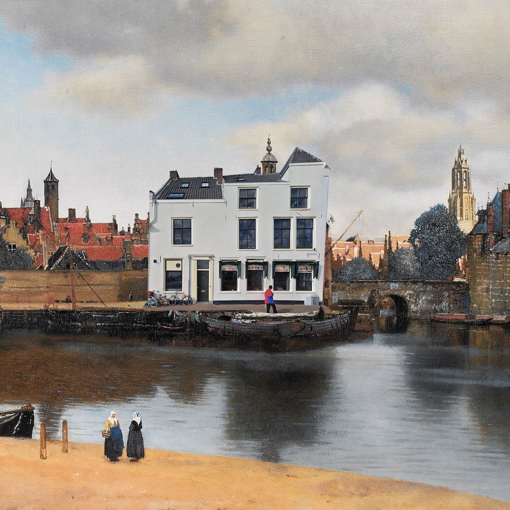

# Program
<!--This program is preliminary and aims to give an overall impression of what to expect. We may shuffle a bit before we cast to schedule into its final form.

We added personal links to provide some context but if you don't like it or want to change it please contact us.-->

The conference has happened, but we still have the [abstract book](files/V_D_abstracts.pdf) and we also have recordings. In the [program](#program-at-a-glance) below you can find links to the individual talks, or you can visit the recording [collection](https://collegerama.tudelft.nl/Mediasite/Channel/ide-symposium-vision-and-depiction-2024). Some talks could not be shared for a variety of reasons.

<!--
- [Program at a glance](#program-at-a-glance)
- [Program in detail](#program-in-detail)
- [Draft abstract book](files/V_D_abstracts.pdf)
- [Draft abstract book (larger font, better on mobile)](files/V_D_abstracts-mobile.pdf)
-->

<!--- [Livestreams](https://collegerama.tudelft.nl/Mediasite/Channel/ide-symposium-vision-and-depiction-2024)-->

<!--
# Program at a glance:
[Wednesday](#wednesday) 
12:00 Registration open (and lunch is served) 
13:00 Opening sessions 
13:15-14:30 [Texture](#texture) 
14:30-15:00 Coffee break 
15:00-16:30 [Knowing through making](#knowing) 
16:30-16:45 Short break 
16:45-18:15 [Keynote collective](#keynote1) 
18:15 [Opening reception](#openingreception)
19:15 [Performance "Force Field"](#forcefield) in Studio 23/24

[Thursday](#thursday) 
9:00-10:30 [Space and motion](#space) 
10:30-11:00 Coffee 
11:00-12:30 [Keynote collective](#keynote2) 
12:30-13:30 Lunch 
13:30-15:30 [Posters](#posters) 
15:00:15:30 Coffee 
15:30-17:00 [Materials & Materiality](#materials) 
17:00-17:15 Short break 
17:15-18:45 [Keynote collective](#keynote3) 
19:30 [Conference dinner](#dinner)

[Friday](#friday) 
9:00-10:30 [Colour and light](#colour) 
10:30-11:00 Coffee 
11:00-12:30 [Keynote collective](#keynote4) 
12:30-13:30 Lunch 
13:30-15:00 [Workshop](https://visionanddepiction.github.io/#workshop) 
15:00:16:00 Visit 'When Images Remain' at the Library 
16:00-17:45 [The aesthetic gaze](#aesthetic) 
17:45-18:15 Closing discussion 
18:30- [Farewell reception](#closingreception) 
-->

# Program in detail

## Wednesday
### 13:00 Opening session

### 13:15-14:30 Texture {#texture}
- [Jan Koenderink](https://scholar.google.com/citations?user=lxW3wvMAAAAJ&hl=en) - Eidolons …	- [recording](https://collegerama.tudelft.nl/Mediasite/Channel/ide-symposium-vision-and-depiction-2024/watch/acd5283628e141ab8b447a0e34eb02b61d)
- [Robert Kentridge](https://www.durham.ac.uk/staff/robert-kentridge/) - The fundamental building blocks of human texture perception.
-	[Yuguang Zhao](https://www.linkedin.com/in/yuguangzhao/?originalSubdomain=nl) - Material perception across different media - comparing perceived attributes in paintings and engravings [recording](https://collegerama.tudelft.nl/Mediasite/Channel/ide-symposium-vision-and-depiction-2024/watch/c948841b1d1b49a8bd61865be8e936d11d)
- [Dale Daykin](https://www.linkedin.com/in/dale-daykin-a2822111a/?originalSubdomain=uk) - Designing Knowledge: Theoretical Considerations on Information and Decoration in Prehistory	 - [recording](https://collegerama.tudelft.nl/Mediasite/Channel/ide-symposium-vision-and-depiction-2024/watch/fcd367b7a55a41038322c7da11a96bac1d)

### 14:30-15:00 Coffee

### 15:00-16:30 Knowing through making {#knowing}
-  [Dejan Grba](https://dejangrba.org/dejan-grba/en/index.php) - Analogies: When I Draw a Song for a Film - [recording](https://collegerama.tudelft.nl/Mediasite/Channel/ide-symposium-vision-and-depiction-2024/watch/a0b36e4fb467433dbf78fc730535eb881d)
-  [Patricia Monteiro](https://lisboa.academia.edu/PatriciaMonteiro) - Depicting Truth through Deceit: the role of the faux altarpiece in the Portuguese mural painting - [recording](https://collegerama.tudelft.nl/Mediasite/Channel/ide-symposium-vision-and-depiction-2024/watch/901b4ca239bc46eba05ffc42feccf5341d)
- [Catelijne van Middelkoop](https://www.tudelft.nl/io/over-io/personen/voormalig-hoogleraren/middelkoop-c-van) - Against Repoussoir: An Exploration of Knowledge through Making - [recording](https://collegerama.tudelft.nl/Mediasite/Channel/ide-symposium-vision-and-depiction-2024/watch/cc9690c3fac748e1919b015943bcd4861d)
- [Jens Dam Ziska](https://www.jensdamziska.com) - Drawings as Cognitive Artefacts
- [Nim Goede](https://uva.academia.edu/NimGoede) - Critical Neuroart: A Neurocultural Reading of Robert Morris' Self-Portrait (EEG) - [recording](https://collegerama.tudelft.nl/Mediasite/Channel/ide-symposium-vision-and-depiction-2024/watch/b7684a1128a84260a1ef6045592d43e51d)

### 16:30-16:45 Short break

### 16:45-18:15 Keynote collective I {#keynote1}
- [Ann-Sophie Lehmann](https://www.rug.nl/staff/a.s.lehmann/?lang=en) - Sketchy, Tiny, Black-and-White. An Ecological Approach to Depicting the World in 17th Century Visual Education.
- [Evelina Domnitch + Dmitry Gelfand](http://www.portablepalace.com) - Trapping the Objectless [recording](https://collegerama.tudelft.nl/Mediasite/Channel/ide-symposium-vision-and-depiction-2024/watch/eb189fbc529b42c496a77aa565c152fa1d)

### 18:15 Opening reception {#openingreception}
We'll have welcome drinks, enjoy great food creations from [Coco Dining](https://www.instagram.com/coco_dining_amsterdam) and experience a performance by keynote speakers [Evelina Domnitch + Dmitry Gelfand](http://www.portablepalace.com), all in the main hall of [Industrial Design Engineering](https://www.tudelft.nl/en/ide/).

## Thursday
### 9:00-10:30 Space and motion {#space}
- Melvin Even, Jean Basset, Pierre Bénard, Pascal Barla - Motion and layout depiction using 2D/3D animation tools
- [Eugene Han](https://aad.lehigh.edu/eugene-han) - Representing the manifold gaze of architectural spaces - [recording](https://collegerama.tudelft.nl/Mediasite/Channel/ide-symposium-vision-and-depiction-2024/watch/d5d6e972ffb147a8a2b867e351f558e51d)
- [Vitor Gomes](https://www.uevora.pt/pessoas?id=4793) - “Framing” the landscape. Movement, Landscape and Cinema.	Assistant Professor - [recording](https://collegerama.tudelft.nl/Mediasite/Channel/ide-symposium-vision-and-depiction-2024/watch/2be99243250147328e9ecdc84c542bd91d)
- [Adrien Bousseau](http://www-sop.inria.fr/members/Adrien.Bousseau/), Mark Sypesteyn, Jan Willem Hoftijzer - Freehand sketching of 3D shapes and implications for computer-aided design; an overview of a multi-disciplinary collaboration - [recording](https://collegerama.tudelft.nl/Mediasite/Channel/ide-symposium-vision-and-depiction-2024/watch/077e20947ad3412fba331c909fa088911d)
- [Dominik Lengyel](https://www.b-tu.de/fg-architektur-und-visualisierung), Catherine Toulouse, Motion as key factor in the perception of space.

### 10:30-11:00 Coffee

### 11:00-12:30 Keynote collective {#keynote2}
- [Tim Jenison](https://en.wikipedia.org/wiki/Tim%27s_Vermeer) - An Optical View of Delft
- [Janne Schimmel](https://janneschimmel.com) - Material Conditions and Sensibilities of Gaming Hard- and Software - [recording](https://collegerama.tudelft.nl/Mediasite/Channel/ide-symposium-vision-and-depiction-2024/watch/d4853493ae664a00b3d50313994a6b721d)

### 12:30-13:30 Lunch

### 13:30-15:00 Posters {#posters}

1. Neanderthal Art and the Problem of Ethnocentrism - [Tullio Abruzzese](https://www.linkedin.com/in/tullio-abruzzese-2935ba5a/?originalSubdomain=nl)
1. 3D printing the Mixtec skull: The opportunities and challenges technology provides in discussing ethical issues surrounding contested heritage in a co-creative, inclusive, and responsible way. - [Liselore Tissen](https://www.universiteitleiden.nl/medewerkers/liselore-tissen#tab-1)
1. A Watermark Recognition System: an Approach to Matching Similar Watermarks - [Vladimir Petkov](https://graphics.tudelft.nl/martin-skrodzki/), Dr. Martin Skrodzki, Diana Banță, Anna Lantink, Sydney Kho, Alexandru Marin
1. Does Camera Movement Move Us, or: How embodied is Film Viewing? - [Lisa-Maria van Klaveren](https://research.rug.nl/en/persons/lisa-maria-klaveren-van), Steven Willemsen
1. Learning variable shape footprints from brushstroke models - [Yuchen Wu](https://researchportal.bath.ac.uk/en/persons/yuchen-wu), Peter M. Hall
1. Exploring infinite spaces from finite confinements - [Scott Jochems](), Joris Rijsdijk, Ravi Snellenberg, Rafael Bidarra, Martin Skrodzki
1. Image Complexity vs Aesthetic Appreciation in Abstract Art - [Maartje Raijmakers](https://www.uva.nl/profiel/r/a/m.e.j.raijmakers/m.e.j.raijmakers.html?cb), Eftychia Stamkou, Laura't Groot
1. The Picture Stares Back - [Andrea J. van Doorn](https://scholar.google.com/citations?user=_6VnqIwAAAAJ&hl=nl), Jan J. Koenderink
1. Image-Works: An Exhibition Study Focused on the Interactions between the Medium of Depiction and (Re-)Presentation in Vision - [Johan Wagemans](https://gestaltrevision.be/home)
1. Eyes, Still-Lifes & Eidolons - Effects of Colour and Object information on Eye Movements - [Doris Braun](https://www.allpsych.uni-giessen.de/doris/), Karl R. Gegenfurtner
1. Painterly Style Transfer with Learned Brush Strokes - [Yuchen Wu](https://researchportal.bath.ac.uk/en/persons/xiaochang-liu), Xiaochang Liu, Peter M. Hall
1. Lifelike Butterflies Painted with Oil and Colourful Dust - [V.E. Mandrij](https://www.linkedin.com/in/v-e-mandrij-a28b3ba5/?originalSubdomain=nl)
1. Mapping visual attention to important and unimportant details in art photographs and paintings - [Maarten Leemans](https://www.linkedin.com/in/maarten-leemans-317547210/), Johan Wagemans
1. Illusory colours in monocular rivalry - [Leone Burridge](https://leoneburridge.com)
1. Artworks -flat packed lunch - [Eve Cromwell](https://evelyncromwell.weebly.com)
1. A love letter and its secret author.
Vermeer's "Girl reading a letter at an open window" as a thought-vision of the viewer - [Martin Lottermoser](https://www.linkedin.com/in/martin-lottermoser-a475b716a/?originalSubdomain=de)
1. Assessing material appearance based on image color entropy - [Masataka Sawayama](https://www.mswym.com)
1. Rethinking Realism: An Interdisciplinary Exploration of Upper Palaeolithic Venus Figurines through eye-tracking methodologies - [Sam Hirst]()
1. Hue-Specific Effects of Lighting on Perceived Atmosphere - [Giulio Palma](https://www.linkedin.com/in/giulio-palma-44827714b/?originalSubdomain=uk), Kelley Nicholas, Graf Erich W., Witzel Christoph
1. The influence of the variations in daylight on the perception of colour - [Catherine Toulouse](https://www.lengyeltoulouse.com), Dominik Lengyel
1. Reconstructing Maarten van Heemskerck's flesh paint - [Lieve d'Hont](https://www.linkedin.com/in/lieve-d-hont-a0527642/?originalSubdomain=nl)
1. Presentation of artworks - [Jenny Mc Namara](https://jennymcnamara.com)
1. Picture-surface, picture-subject: an empirical assessment of Wollheim´s theory of Twofoldness - [Anna Miscena](https://kunstgeschichte.univie.ac.at/ueber-uns/mitarbeiterinnen/projektmitarbeiterinnen/miscena-anna/), Jozsef Arato, Raphael Rosenberg
1. What words do we use to describe colour-changing (iridescent) surfaces? - [Li Shiwen](https://www.linkedin.com/in/lshiwen/?originalSubdomain=uk), Pascal Barla, Sylvia C. Pont, Hannah E. Smithson
1. Cast shadows enhance pictorial depth perception of volumetric shapes - [Robert Volcic](https://nyuad.nyu.edu/en/academics/divisions/science/faculty/robert-volcic.html)

### 15:00-15:30 Coffee

### 15:30-17:00 Materials & Materiality {#materials}
- [Sarah Kaiser](https://www.burg-halle.de/hochschule/information/personen/p/sarah-kaiser/) and [Andi Wagner](https://andiwagner.de) - Solid and fleeting. Depicting material stories in a materials collection - [recording](https://collegerama.tudelft.nl/Mediasite/Channel/ide-symposium-vision-and-depiction-2024/watch/ca7dd406a1ed4c77979d82418cc28b7e1d)
- [Christopher Linden](https://www.researchgate.net/profile/Christopher-Linden-3), Stefanie De Winter, Johan Wagemans - Free Exploration of Materiality and Space Across Three Contemporary Art Exhibitions	- [recording](https://collegerama.tudelft.nl/Mediasite/Channel/ide-symposium-vision-and-depiction-2024/watch/d335ae27cec944129abf9d11f50e4f4a1d)
- [Hannah De Corte](http://www.hannahdecorte.com) - Pieter Bruegel's Blind Figures, Visuality and the Human Position
- [Willemijn Elkhuizen](https://www.tudelft.nl/io/over-io/personen/elkhuizen-ws) - Material Experience Framework in Cultural Heritage 	
- [Cleo Nisse](https://arthistory.columbia.edu/content/cleo-nisse) - Tintoretto's Texture: An Experiment in Non-Contact 3D Laser Scanning

### 17:00-17:15 Short break

### 17:15-18:45 Keynote collective {#keynote3}
- [Paul Pettitt](https://www.durham.ac.uk/staff/paul-pettitt/) - From body marks to figurative art: what we know about the Ice Age evolution of human visual culture - [recording](https://collegerama.tudelft.nl/Mediasite/Channel/ide-symposium-vision-and-depiction-2024/watch/235f152576644f20b761b6dd7be487651d)
- [Persijn Broersen and Margit Lukacs](https://www.pmpmpm.com) - Vision & Fiction, Depiction & Deception; The Place of Image

### 19:30 Conference dinner {#dinner}

We will have our conference dinner at [Lychee restaurant](https://lycheedelft.com/home), one of the most popular places in town! Besides awesome food, you can look out the window and imagine Vermeer (and Tim!) viewing in your direction.

## Friday
### 9:00-10:30 Colour and light {#colour}
- [Anya Hurlbert](https://www.ncl.ac.uk/psychology/people/profile/anyahurlbert.html), Laura Monaghan, Fatima Felisberti, Alejandro Parraga - The Colours of Ugliness	- [recording](https://collegerama.tudelft.nl/Mediasite/Channel/ide-symposium-vision-and-depiction-2024/watch/b106ba5d23604eca949e2de6d835bef71d)
- [Sylvia Pont](https://www.tudelft.nl/io/over-io/personen/pont-sc), Antoon Melissen - Form, material, light and meaning of the reliefs of Schoonhoven and their photographs of Wolleh -	[recording](https://collegerama.tudelft.nl/Mediasite/Channel/ide-symposium-vision-and-depiction-2024/watch/b8366d569b9448c2852b7dfd05f6ef071d)
- [Francesca Di Cicco](https://www.uu.nl/staff/FdiCicco) - How to paint a smell. The use of cross-modal correspondence between smell and vision in art and design -	[recording](https://collegerama.tudelft.nl/Mediasite/Channel/ide-symposium-vision-and-depiction-2024/watch/95707d70dc6b4db2bd8c32099e5da6aa1d)
- [Eleftheria Pistolas](https://www.linkedin.com/in/eleftheria-pistolas-02301313a/), Johan Wagemans - The appeal of Ganzfeld art: a matter of losing and regaining grip on depth? -	[recording](https://collegerama.tudelft.nl/Mediasite/Channel/ide-symposium-vision-and-depiction-2024/watch/24e37a598ffc4a38baa6e460c5ebdf811d)
- [Jan Willem Hoftijzer & Mark Sypesteyn](http://www.delftdesigndrawing.com) - The interplay between colour and value - [recording](https://collegerama.tudelft.nl/Mediasite/Channel/ide-symposium-vision-and-depiction-2024/watch/1b6ea365fe5b4945b8e1172e031c73e11d)

### 10:30-11:00 Coffee

### 11:00-12:30 Keynote collective {#keynote4}
- [Hannah Smithson](https://www.psy.ox.ac.uk/people/hannah-smithson) - From Pixels to Perception: Appreciating the structure in visual signals of material properties.
- [Joost Swarte](https://www.joostswarte.nl) - To the observer - [recording](https://collegerama.tudelft.nl/Mediasite/Channel/ide-symposium-vision-and-depiction-2024/watch/d080be656fbd42c189981c0cb79b4c431d)

### 12:30-13:30 Lunch

### 13:30-15:00 [Workshop](https://visionanddepiction.github.io/#workshop)

### 15:00:16:00 Visit 'When Images Remain' at the Library. Coffee served at lecture room from 15:30

### 16:00-17:45 The aesthetic gaze {#aesthetic}
- [Stefanie De Winter](https://www.stefaniedewinter.com), Christopher Linden, Johan Wagemans - Flattened Intensities, Intensified Flatness : Aesthetic Appreciation of Contemporary Abstract Art Changes as a Result of Context Information -	[recording](https://collegerama.tudelft.nl/Mediasite/Channel/ide-symposium-vision-and-depiction-2024/watch/c7fc063dfea84e30934340b705cafc911d)
- [Gregor Hayn-Leichsenring](https://scholar.google.com/citations?user=ZnmuzZIAAAAJ&hl=en) - Disentangled Aesthetics – In Art Portraits Global Image Properties Predict the Beauty of the Painting but not the Attractiveness of the Sitter	- [recording](https://collegerama.tudelft.nl/Mediasite/Channel/ide-symposium-vision-and-depiction-2024/watch/aafd5a62769a4553b5d467abba79e3cf1d)
- [Jeroen Stumpel](https://www.uu.nl/medewerkers/JFHJStumpel) - On Mondrian, meaning and balance.
- [Yanai Toister](https://yanaitoister.com) - Seeing and Sensing - [recording](https://collegerama.tudelft.nl/Mediasite/Channel/ide-symposium-vision-and-depiction-2024/watch/2e18e41adb1c4096a8cd5b63e8dc6f911d)
- [David Drogin](https://www.fitnyc.edu/creative-nexus/faculty/directory/drogin-david.php) - A Semiotics of Perspective and Vision in Donatello’s Relief Sculpture	 - [recording](https://collegerama.tudelft.nl/Mediasite/Channel/ide-symposium-vision-and-depiction-2024/watch/36d230eb88634af5b86949015090dc3e1d)

### 17:45-18:15 Closing discussion

### 18:30 - Farewell reception {#closingreception}
Very close to the train station and opposite to musuem Prinsenhof we reserved a cosy space at [Bar/Baar](https://barbaar.nl) where we will have some farewell food and drinks.

## Performance Force Field {#forcefield}
Artists: [Evelina Domnitch + Dmitry Gelfand](http://www.portablepalace.com)  
During the Spacelab era, JPL researchers pioneered acoustic levitation techniques for trapping and rotating liquid samples in microgravity. In recent decades the selfsame methods have been implemented for contactless manipulation on Earth. Numerous experiments have been performed in a vast range of research areas, including fluid dynamics, analytical chemistry, atmospheric sciences, molecular biology, and tabletop astrophysics. In Force Field, acoustically levitated water droplets resonate, vaporise and reassemble into spheroids, toroids and oscillating polygons while spinning nearly devoid of shear. The performance simultaneously taps into the 3-dimensionality of sound, the elusive physicality of water, as well as the rotational dynamics of celestial and subatomic bodies.
